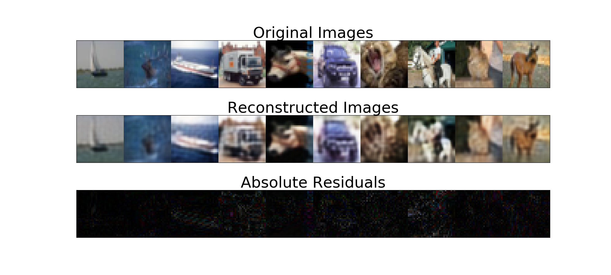

# Gradient-Origin-Networks-Julia

Reimplementation of Gradient Origin Networks in Julia with Knet Framework (Koç University Deep Learning Framework).

This repo contains the Julia implementation of the paper Gradient Origin Networks [1] with the Knet Framework.

# Implementation Environment Details

-> Julia Version Info: Version 1.6.3 (2021-09-23)

-> Platform Info :  "OS: Linux (x86_64-pc-linux-gnu) CPU: Intel(R) Xeon(R) Gold 6248 CPU @ 2.50GHz, GPU : CuDevice(0): Tesla T4"

-> Required Julia Packages : Specified in requirements.txt file

# Implementation Notes

-> src folder includes Julia implementations for GON, Variational GON and Implicit GON models as well as some other model implementations (AE, VAE, etc.) to compare.

-> Pytorch Debug Files : The codes in Pytorch_Debug_Files are based on the published GON implementation [2] which provides loggers for train and test set loss values for each epoch. I use them to compare my Julia implementation with Pytorch implementation.

-> Experiment Notebooks : "Experimental_Notebooks" and "Experimental_Notebooks_Deprecated" files includes my debugging and experimenting notebooks. However, these notebooks will be deleted soon since I include the finalized version of the codes in "src" folder.
# TODO

-> Optimization performance check for Variational GON.

# Datasets
We performed experiments on MNIST, Fashion-MNIST, CIFAR-10 and subsampled COIL-20 image databases. The results are given in the following sections.

# Results
## GON
|Model\Dataset| MNIST | Fashion-MNIST| CIFAR-10| COIL-20|
|  ---         | ---       | ---        | ---  | --- |
|GON (ngf:16,nz:256)| 0.1176/.01423| 0.6043/0.6427|7.6046/7.7152|1.3784/2.5973|
|GON Detached (ngf:16, nz:256)| 2.102/2.463| 3.996/4.123|8.685/8.728|4.428/5.410|
|GON (ngf:32, nz:256)| 0.0642/0.0884|0.4482/0.5184|6.871/7.260|0.5529/3.146|
|GON (ngf:16, nz:512)| 0.542/0.0903|0.1233/0.132|3.346/3.413| - |
|Conv AE (ngf:16, nz:256)| 0.0815/0.1352| 0.5223/0.5755|7.382/7.542|0.942/4.537|
|Conv AE (ngf:32, nz:256)| 0.0438/0.0775| 0.3899/0.4804| 6.496/6.959| 0.4344/4.0801|

Table 1: Summed Squared Error Losses on Train and Test Sets After 500 Epochs of Training

## Implicit GON
|Model\Dataset| MNIST | Fashion-MNIST | COIL-20|
|  ---         | ---       | ---        | ---  |
|Implicit - GON| 0.00530/0.00535| 0.0087/0.0089|0.0072/0.115|

Table 2: Mean Squared Error Losses on Train and Test Sets (MNIST and Fashion-MNIST trained for 100 Epochs whereas COIL-20 trained for 500 Epochs)

## Variational GON
|Model\Dataset| MNIST | Fashion-MNIST| CIFAR-10| COIL-20|
|  ---         | ---       | ---        | ---  | --- |
|V-GON (ngf:16, nz:256) | 8.5681/8.9609| 9.9733/10.178| 43.269/43.812| 8.917/11.427|
|VAE (ngf:8, nz:256) | 6.859/7.3373| 9.043/9.205| 36.827/37.018| 10.386/11.855|
|VAE (ngf:16, nz:256)| 6.057/6.554| 8.178/8.429| 35.176/35.622| 8.1/9.31|

Table 3: Summed Squared Error Losses on Train and Test Sets After 1000 Epochs of Training

# Visaual Results

## GON
### GON (ngf:16, nz:256) Test Set Reconstruction Examples
#### MNIST

#### Fashion MNIST

#### CIFAR-10

#### COIL-20

### GON (ngf:16, nz:512) Test Set Reconstruction Examples
#### CIFAR-10

## Implicit GON
### Super Resolution Examples

#### MNIST

### Fashion-MNIST

## Variational GON
### Variational GON (ngf:16, nz = 256)
#### MNIST Test Set Reconstruction

#### Fashion-MNIST Test Set Reconstruction

#### MNIST Sampling

#### Fashion-MNIST Sampling

# Ablation Studies
## GON Activation Function
GONs require activation functions with non-zero second derivative. We trained 3 same GON architecture with ELU,RELU, and SELU on MNIST for 50 epochs as illustrated in the next figure. Note that GON with RELU underperforms. See Ablation_Studies folder for training experiments.

## GON Latent Initialization
Initialization of latent at the origin is sufficient for GONs. We also experimented with random initialization of latent vector drawn from zero mean diagonal sigma square covariance matrix for various sigma (standard deviation) values. Note that as we increase the sigma, the GON model performs worse.

# Refences

[1] Sam Bond-Taylor and Chris G. Willcocks. Gradient origin networks. In International Conference on Learning Representations, 2021. URL https://openreview.net/pdf?id=0O_cQfw6uEh.

[2] https://github.com/cwkx/GON
